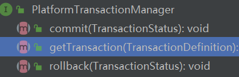
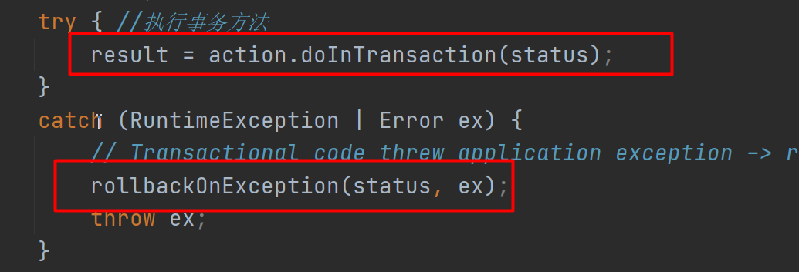

# 1、为什么研究源码

感觉源码能学到很多东西


# 2、Spring扩展

- 1、@Autowired。
  - 我们在业务逻辑中定义很多的注解。
  - 启动期间，注解完成功能，运行期间
- 2、BeanPostProcessor
- 3、**自定义HandlerMapping实现灰度发布**
  - HandlerMapping 找映射  启动以后  扫描所有Controller的@GetMapping进行匹配
  - 给Controller上标注版本号 @ControllerVersion(1.0)   @ControllerVersion(2.0) 
  - /v1/hello   /v2/hello
  - /v1下面的返回的是ControllerVersion1的Controller的所有方法。
  - /v2 下的是version2的
  - 同一个功能有多个版本存在
  - hellov1() /v1/hello   hellov2 /v2/hello
  - HandlerMapping 初始化机制，顺便解析  @ControllerVersion，存在定义的信息中。分析好以后存在mappingRegistry这里

# 3、IOC、AOP、生命周期

IOC：容器，在Spring的底层其实是一些map。最重的所有单实例组件会放在 ApplicationContext 的 singletonObjects中。以后要用组件，默认都看这个里面有没有

>  ApplicationContext   和 BeanFactory两个接口
>
> BeanFactory定义工厂创建和获取Bean流程的
>
> ApplicationContext   定义了Bean的增强处理以及容器保存，等各种流程的
>
> ApplicationContext   里面第一次要用到bean会使用工厂BeanFactory先来创建，创建好的保存在容器中


AOP： AnnotationAspectJAutoProxyCreator 后置处理器，会在启动的时候分析所有@Aspect切面信息，封装成增强器链，并为目标对象创建代理放在容器中

执行期间 代理对象会链式调用AOP切面定义的增强方法


生命周期：

BeanFactoryPostProcessor：在BeanFactory初始化前后拦截

BeanPostProcessor：在所有组件创建对象及初始化前后拦截

InitializingBean：组件单独实现它，可以在组件赋值结束以后调用初始化进行增强处理

SmartInitializingBean：所有组件都创建好以后，每个组件再来 SmartInitializingBean


Bean： 保存BeanDefinition信息 ---  根据BeanDefinition信息创建对象 ---  赋值 --- 初始化 


# 4、Spring预留了哪些扩展点

Spring几乎所有核心组件都是先有接口。

我们可以自己写实现。

Spring最爱模板模式。

接口 ---- 抽象实现类（预留很多的关键步骤，abstract method） ---- 具体实现类（我们自己搞），实现父类的预留模板就能完成


SpringMVC：九大组件

WebConfigurer

Spring容器的父子容器；Web版的ioc容器，启动在onRefresh的时候创建嵌入式Tomcat


# 5、我怎么设计Spring

借鉴Spring的整个后置处理机制，

优化核心环节，轻量版的Spring。关注容器组件的保存、创建、依赖、aop的处理


# 6、Spring事务机制

@Transactional 标注在方法或者类上就能与事务


- TransactionAttribute:  事务属性，封装事务信息的；
- ***PlatformTransactionManager***： 事务的管理器；定义事务的提交和回滚，引入了数据库模块就会放在容器中，定义提交回滚的实现
- ***TransactionTemplate***: 包含了事务管理器，事务管理器又由他调用，写了一个利用反射执行目标业务的，成功就提交，失败就用事务管理器回滚。定义大逻辑
- **TransactionInterceptor**：是一个AOP的 MethodInterceptor ，可以拦截方法，这是事务切面的支持类TransactionAspectSupport，所有标注了@Transactional的都会被封装成这个拦截器的执行链，目标方法的执行就是事务拦截器的执行

那个后置处理器进来处理了事务切面的功能 - TransactionInterceptor

AOP的切面处理器；@Aspect、打断点，什么时候分析了每一个方法 @Transactional  注解并封装TransactionInterceptor，方法执行的时候TransactionInterceptor【advice】执行，interceptor使用 TransactionTemplate调用和处理整个过程

```

```







- 所有事务要提交，是由事务管理器进行提交和回滚
- 

# 7、Spring怎么保证Controller并发安全


@Controller在Spring底层是单实例的，Spring没有做任何操作手段，我们自己搞定

DispatcherServlet收到请求以后，HandlerAdapter利用反射调用Controller的方法


保证线程安全的两种办法

> 1、我们不能在 Controller里面写共享数据（属性）\非要用，就 ThreadLocal。juc里面的各种原子类
>
> 2、@Scope("prototype") @Controller
>
> ​			每个请求过来创建 Controller 对象。导致最终对象过多，内存爆炸


**Tomcat为啥Servlet只创建一次对象。**速度就很快


# 8、Spring事务的传播行为、隔离级别

https://www.bilibili.com/video/BV1uE411C7CW?p=99

事务的所有


A{

@Autowired //Spring解决了循环依赖

 A a;

  tx_a(){

​    tx_b();//tx_b的所有设置是不生效的。

​    a.tx_b();//全部生效的

​	 this.tx_b();//不生效，只要不是代理对象都不会生效，SpringAOP默认没有设置暴露代理对象。


  }


  tx_b(){

   }

}


# 9、设计模式的应用

模板：父类定义规则

访问者：WebMvcConfigurer

策略：动态判断支持哪种策略

组合：无处不在

命令：天天写

Alipay、WeiXin

for( pay:  payStrateage){

​    if(pay.support(request)){

​        pay.processPay(request);

​    }

}

# 10、啥时候需要查看源码解决问题

openfeign：谷粒商城   feign异步丢失请求头（https://www.bilibili.com/video/BV1np4y1C7Yf?p=268）

请求远程调用其他服务的时候，经常得不到预期数据。debug源码看是我们服务没响应的，还是组件不对的。


SpringMVC注解版。自己写了一个ViewResolver，把index.jsp这种功能给搞炸了，发现底层源码，如果我们自己有，他都不会创建默认的视图解析器


#  11、Spring学到的思想

后置增强、生命周期、各种设计模式


# 12、依赖注入

**构造器依赖注入**

组件没有无参构造器，让Spring给他创建对象。Spring必须调用有参，并且去容器中确定构造器参数的值

handlermapping(ViewResolver view){

// 应用于某个组件 必须拥有 其他组件才能正常工作的，我们就强制构造器注入

}


setter方法、属性的注入都相当于如果当前没有，以后还能再设置。


# 13、生产环境

和框架源码无关

