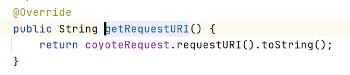

<center> <h1>Tomcat 篇</h1> </center>
# 一、起步

## 1、源码环境搭建

### 1、下载源码


### 2、改造为maven工程

```xml
<!-- pom.xml -->
<?xml version="1.0" encoding="UTF-8"?>
<project xmlns="http://maven.apache.org/POM/4.0.0"
         xmlns:xsi="http://www.w3.org/2001/XMLSchema-instance"
         xsi:schemaLocation="http://maven.apache.org/POM/4.0.0 http://maven.apache.org/xsd/maven-4.0.0.xsd">
    <modelVersion>4.0.0</modelVersion>
    <groupId>org.apache.tomcat</groupId>
    <artifactId>tomcat9</artifactId>
    <name>tomcat-9.0.41</name>
    <version>9.0.41</version>
    <build>
        <finalName>tomcat-9.0.41</finalName>
        <sourceDirectory>java</sourceDirectory>
        <!--<testSourceDirectory>test</testSourceDirectory>  test 下的有些文件报错，因此将test文件夹去掉了-->
        <resources>
            <resource>
                <directory>java</directory>
            </resource>
        </resources>
        <testResources>
            <testResource>
                <directory>test</directory>
            </testResource>
        </testResources>
        <plugins>
            <plugin>
                <groupId>org.apache.maven.plugins</groupId>
                <artifactId>maven-compiler-plugin</artifactId>
                <version>3.6.0</version>
                <configuration>
                    <encoding>UTF-8</encoding>
                    <source>1.8</source>
                    <target>1.8</target>
                </configuration>
            </plugin>
            <plugin>
                <groupId>org.apache.maven.plugins</groupId>
                <artifactId>maven-jar-plugin</artifactId>
                <version>3.0.2</version>
            </plugin>
        </plugins>
    </build>
     <dependencies>
        <dependency>
            <groupId>org.apache.ant</groupId>
            <artifactId>ant</artifactId>
            <version>1.9.5</version>
        </dependency>
         <!-- https://mvnrepository.com/artifact/biz.aQute.bnd/annotation -->
         <!-- https://mvnrepository.com/artifact/biz.aQute.bnd/biz.aQute.bndlib -->
         <dependency>
             <groupId>biz.aQute.bnd</groupId>
             <artifactId>biz.aQute.bndlib</artifactId>
             <version>5.2.0</version>
             <scope>provided</scope>
         </dependency>

         <!-- https://mvnrepository.com/artifact/org.apache.jasper/org.apache.jasper -->
         <!-- https://mvnrepository.com/artifact/org.apache.tomcat/tomcat-jasper -->
         <dependency>
             <groupId>org.apache.tomcat</groupId>
             <artifactId>tomcat-jasper</artifactId>
             <version>9.0.41</version>
         </dependency>
         <dependency>
            <groupId>org.apache.ant</groupId>
            <artifactId>ant-apache-log4j</artifactId>
            <version>1.9.5</version>
        </dependency>
        <dependency>
            <groupId>org.apache.ant</groupId>
            <artifactId>ant-commons-logging</artifactId>
            <version>1.9.5</version>
        </dependency>
        <dependency>
            <groupId>javax.xml.rpc</groupId>
            <artifactId>javax.xml.rpc-api</artifactId>
            <version>1.1</version>
        </dependency>
        <dependency>
            <groupId>wsdl4j</groupId>
            <artifactId>wsdl4j</artifactId>
            <version>1.6.2</version>
        </dependency>
        <dependency>
            <groupId>org.eclipse.jdt.core.compiler</groupId>
            <artifactId>ecj</artifactId>
            <version>4.6.1</version>
        </dependency>
    </dependencies>
</project>
```

### 3、导入idea


### 4、创建启动类


### 5、添加vm options


```properties
-Duser.language=en
-Duser.region=US
-Dfile.encoding=UTF-8
-Dsun.jnu.encoding=UTF-8
```


# 二、架构


# 三、核心组件

- Lifecycle
- Container： 
- Engine
- Host
- Context
- Wrapper
- Servlet
- Pipeline
- Vavle
- Connector
- LifecycleListener -》 HostConfig
- 

## 1、基础设计


Tomcat要实现两个核心功能：
1） 处理Socket连接，负责网络字节流与Request和Response对象的转化。
2） 加载和管理Servlet，以及具体处理Request请求。
因此Tomcat设计了两个核心组件连接器（Connector）和容器（Container）来分别做这两件事情。连接器负责对外交流，容器负责内部处理逻辑


## 2、协议处理器与适配器

接上文，连接器并不能直接处理数据。利用协议处理器与适配器完成工作


Tomcat 支持的IO模型（自8.5/9.0 版本起，Tomcat 移除了 对 BIO 的支持）：

| IO模型（传输层） | 描述                                                         |
| ---------------- | ------------------------------------------------------------ |
| NIO              | 非阻塞I/O，采用Java NIO类库实现。                            |
| NIO2             | 异步I/O，采用JDK 7最新的NIO2类库实现。                       |
| APR              | 采用Apache可移植运行库实现，是C/C++编写的本地库。如果选择该方 案，需要单独安装APR库。 |


| 应用层协议 | 描述                                                         |
| ---------- | ------------------------------------------------------------ |
| HTTP/1.1   | 这是大部分Web应用采用的访问协议。                            |
| AJP        | 用于和Web服务器集成（如Apache），以实现对静态资源的优化以及 集群部署，当前支持AJP/1.3。 |
| HTTP/2     | HTTP 2.0大幅度的提升了Web性能。下一代HTTP协议 ， 自8.5以及9.0 版本之后支持。 |


## 3、连接器组件

连接器中的各个组件的作用如下：


### 1、EndPoint
1） EndPoint ： Coyote 通信端点，即通信监听的接口，是具体Socket接收和发送处理器，是对传输层的抽象，因此EndPoint用来实现TCP/IP协议的。
2） Tomcat 并没有EndPoint 接口，而是提供了一个抽象类AbstractEndpoint ，里面定义了两个内部类：Acceptor和SocketProcessor。Acceptor用于监听Socket连接请求。SocketProcessor用于处理接收到的Socket请求，它实现Runnable接口，在Run方法里调用协议处理组件Processor进行处理。为了提高处理能力，SocketProcessor被提交到
线程池来执行。而这个线程池叫作执行器（Executor)。

### 2、Processor

Processor ： Coyote 协议处理接口 ，如果说EndPoint是用来实现TCP/IP协议的，那么Processor用来实现HTTP协议，Processor接收来自EndPoint的Socket，读取字节流解析成Tomcat Request和Response对象，并通过Adapter将其提交到容器处理，Processor是对应用层协议的抽象。

### 3、ProtocolHandler

ProtocolHandler： Coyote 协议接口， 通过Endpoint 和 Processor ， 实现针对具体协议的处理能力。Tomcat 按照协议和I/O 提供了6个实现类 ： AjpNioProtocol ，AjpAprProtocol， AjpNio2Protocol ， Http11NioProtocol ，Http11Nio2Protocol ，Http11AprProtocol。我们在配置tomcat/conf/server.xml 时 ， 至少要指定具体的ProtocolHandler , 当然也可以指定协议名称 ， 如 ： HTTP/1.1 ，如果安装了APR，那么
将使用Http11AprProtocol ， 否则使用 Http11NioProtocol 。

### 4、Adapter

由于协议不同，客户端发过来的请求信息也不尽相同，Tomcat定义了自己的Request类来“存放”这些请求信息。ProtocolHandler接口负责解析请求并生成Tomcat Request类。但是这个Request对象不是标准的ServletRequest，也就意味着，不能用TomcatRequest作为参数来调用容器。Tomcat设计者的解决方案是引入CoyoteAdapter，这是适配器模式的经典运用，连接器调用CoyoteAdapter的Sevice方法，传入的是TomcatRequest对象，CoyoteAdapter负责将Tomcat Request转成ServletRequest，再调用容器的Service方法。  

Http11NIOProtocol表示非阻塞模式Http协议的通信，它主要包含NioEndpoint组件和Http11NioProcessor组件。一个连接到来时，将被注册到NioChannel队列中，由Poller负责检测通道的读写事件，并在创建任务后扔进线程池中。


## 4、Catalina

Catalina负责管理Server，而Server表示着整个服务器。Server下面有多个服务Service，每个服务都包含着多个连接器组件Connector（Coyote 实现）和一个容器组件Container。在Tomcat 启动的时候，会初始化一个Catalina的实例。 


| 组件      | 职责                                                         |
| --------- | ------------------------------------------------------------ |
| Catalina  | 负责解析Tomcat的配置文件 , 以此来创建服务器Server组件，并根据 命令来对其进行管理 |
| Server    | 服务器表示整个Catalina Servlet容器以及其它组件，负责组装并启动 Servlet引擎,Tomcat连接器。Server通过实现Lifecycle接口，提供了 一种优雅的启动和关闭整个系统的方式 |
| Service   | 服务是Server内部的组件，一个Server包含多个Service。它将若干个 Connector组件绑定到一个Container（Engine）上 |
| Connector | 连接器，处理与客户端的通信，它负责接收客户请求，然后转给相关 的容器处理，最后向客户返回响应结果 |
| Container | 容器，负责处理用户的servlet请求，并返回对象给web用户的模块   |


## 5、Container  

Tomcat设计了4种容器，分别是Engine、Host、Context和Wrapper。这4种容器不是平行关系，而是父子关系

Tomcat通过一种分层的架构，使得Servlet容器具有很好的灵活性  

| 容器    | 描述                                                         |
| ------- | ------------------------------------------------------------ |
| Engine  | 表示整个Catalina的Servlet引擎，用来管理多个虚拟站点，一个Service 最多只能有一个Engine，但是一个引擎可包含多个Host |
| Host    | 代表一个虚拟主机，或者说一个站点，可以给Tomcat配置多个虚拟主 机地址，而一个虚拟主机下可包含多个Context |
| Context | 表示一个Web应用程序， 一个Web应用可包含多个Wrapper           |
| Wrapper | 表示一个Servlet，Wrapper 作为容器中的最底层，不能包含子容器  |


# 四、运行原理

## 1、启动加载流程

### 1、lifecycle组件的创建流程

Bootstrap.main()

--->Catalina.load()

--->parseServerXml(true);

--->逐行解析文件

--->创建Lifecycle对象

--->对象创建结束


### 2、启动流程


### 2、对象创建完成以后


### 3、Tomcat里面的模板模式

- Lifecycle（Server、Service、Engine、Host、Context、Wrapper）

  - abstract LifecycleBase

    【init()-abstract void initInternal()】

    【start()-abstract void startInternal()】

    【stop()-abstract void stopInternal()】

    【destroy()-abstract void destroyInternal()】

    以下的所有组件都会实现真正的生命周期方法而被调用

    - StandardServer
    - StandardService
    - StandardEngine
    - StandardHost
    - StandardContext
    - StandardWrapper


## 2、请求处理流程

1) Connector组件Endpoint中的Acceptor监听客户端套接字连接并接收Socket。
2) 将连接交给线程池Executor处理，开始执行请求响应任务。
3) Processor组件读取消息报文，解析请求行、请求体、请求头，封装成Request对象。
4) Mapper组件根据请求行的URL值和请求头的Host值匹配由哪个Host容器、Context容器、Wrapper容器处理请求。
5) CoyoteAdaptor组件负责将Connector组件和Engine容器关联起来，把生成的Request对象和响应对象Response传递到Engine容器中，调用 Pipeline。
6) Engine容器的管道开始处理，管道中包含若干个Valve、每个Valve负责部分处理逻辑。执行完Valve后会执行基础的 Valve--StandardEngineValve，负责调用Host容器的Pipeline。
7) Host容器的管道开始处理，流程类似，最后执行 Context容器的Pipeline。
8) Context容器的管道开始处理，流程类似，最后执行 Wrapper容器的Pipeline。
9) Wrapper容器的管道开始处理，流程类似，最后执行 Wrapper容器对应的Servlet对象的处理方法  

-----

1、请求被Acceptor（socket.accept()）接受到数据

2、Acceptor把请求封装成 SocketWrapperBase，直接发给线程池

3、SocketWrapperBase的run开始执行。使用 poller 拿到通道东西进行处理。

4、拿到协议处理器【ProtocolHandler】==》AbstractProtocol==里面有 Http11NioProtocol。处理HTTP1.1的

5、ProtocolHandler 创建出 Processor来处理请求

6、Http11Processor 里面有 CoyoteAdapter

7、Http11Processor 调用 service 方法

- 1、准备CoyoteRequest对象，并且分配buffer空间准备来读取Channel里面的数据

- 2、解析请求头、请求行等信息

- 3、准备请求prepareRequest()；校验之前解析的请求数据是否合法

- 4、Http11Processor 调用 getAdapter().service(request, response);

  - 1、拿到适配器 **CoyoteAdapter**，调用service（）。主要就是CoyoteRequest和HttpRequest的互转

    - 1、没有转换过，connector创建一个新的HttpServletRequest对象，保存CoyoteRequest的内容
    - 装饰模式 HttpServletRequest.getMethod--》CoyoteRequest.getMethod。不用挨个属性搬家
    - 
    - 调用容器；CoyoteAdapter 的 343 行请求开始流转。拿到每个容器里面的管道的阀门，开始执行请求处理

    ```java
    connector.getService().getContainer().getPipeline().getFirst().invoke(
            request, response);
    //得到Service？里面的容器也就是Engine？
    ```

    

    


## 注意、Lifecycle与状态流转

LifecycleListener 怎么定义？


- LifecycleBase
- LifecycleListener


