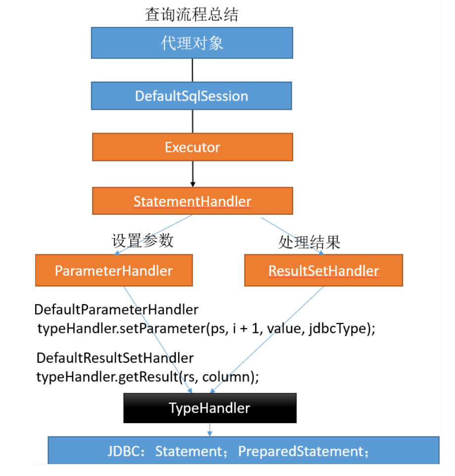

<center> <h1>MyBatis源码篇</h1> </center>
# 1、MyBatis 原理

## 1、jdbc基础

```java
  	    //JDBC基础代码
        Connection connection = dataSource.getConnection();
        Statement statement = connection.createStatement();
        ResultSet resultSet = statement.executeQuery("select count(*) from world.city");

        while (resultSet.next()) {
            long aLong = resultSet.getLong(1);
            System.out.println(aLong);
        }
        resultSet.close();
        connection.close();
```


## 2、原生MyBatis用法

```java
@SpringBootTest
class MybatisSourcesApplicationTests {

    @Autowired
    DataSource dataSource;

    @Test
    void contextLoads() throws SQLException {
        Connection connection = dataSource.getConnection();
        System.out.println(connection);
        connection.close();

    }

    @Test
    public void getFromDb() throws IOException {
        //1、得到 SqlSessionFactory
        SqlSessionFactory sqlSessionFactory = getSqlSessionFactory();

        //2、得到 sqlSession ,代表和数据库一次回话
        SqlSession sqlSession = sqlSessionFactory.openSession();

        //3、得到真正操作数据库的Dao
        CityMapper mapper = sqlSession.getMapper(CityMapper.class);
        City city = mapper.getCityById(1L);

        System.out.println(city);

        sqlSession.close();
    }


    /**
     * 1、根据全局配置文件获取 SqlSessionFactory
     * @return
     * @throws IOException
     */
    public SqlSessionFactory getSqlSessionFactory() throws IOException {
        String resource = "mybatis/mybatis-config.xml";
        InputStream inputStream = Resources.getResourceAsStream(resource);
        SqlSessionFactory sqlSessionFactory = new SqlSessionFactoryBuilder().build(inputStream);

        //1、拿到全局配置
        TransactionFactory transactionFactory = new JdbcTransactionFactory();
        //准备环境信息
        Environment environment = new Environment("development", transactionFactory, dataSource);
        //2、使用我们的数据源
        sqlSessionFactory.getConfiguration().setEnvironment(environment);
        

        //使用mybatis-config.xml + Spring的数据源
        return sqlSessionFactory;
    }


}
```

- 所有Mapper接口的实现类都是  org.apache.ibatis.binding.MapperProxy
  - public class MapperProxy<T> implements InvocationHandler, Serializable
  - MyBatis自动为我们所有的Mapper接口创建出MapperProxy的实现，这个实现就是一个动态代理


## 3、核心对象分析

| Mybatis核心对象      | 解释                                                         |
| -------------------- | ------------------------------------------------------------ |
| **SqlSession**       | 作为MyBatis工作的主要顶层API，表示和数据库交互的会话，完成必要数据库增删改查功能 |
| **Executor**         | MyBatis执行器，是MyBatis 调度的核心，负责SQL语句的生成和查询缓存的维护 |
| **StatementHandler** | 封装了JDBC Statement操作，负责对JDBC statement 的操作，如设置参数、将Statement结果集转换成List集合。<br />根据不同的Sql创建不同的statement。 |
| **ParameterHandler** | 负责对用户传递的参数转换成JDBC Statement 所需要的参数<br />负责参数预编译设置等工作 |
| **ResultSetHandler** | 负责将JDBC返回的ResultSet结果集对象转换成List类型的集合；<br />负责处理返回结果，要根据方法的不同返回值类型进行判断的 |
| **TypeHandler**      | 负责java数据类型和jdbc数据类型之间的映射和转换<br />负责预编译以及结果集中数据库数据与java类型的转换 |
| **MappedStatement**  | MappedStatement维护了一条mapper.xml文件里面 select 、update、delete、insert节点的封装<br />每个方法的详情封装 |
| **SqlSource**        | 负责根据用户传递的parameterObject，动态地生成SQL语句，将信息封装到BoundSql对象中，并返回 |
| **BoundSql**         | 表示动态生成的SQL语句以及相应的参数信息                      |
| **Configuration**    | MyBatis所有的配置信息都维持在Configuration对象之中           |




# 3、MyBatis 拦截器原理

## 1、四大对象工作流程

- **StatementHandler**：处理sql语句预编译，设置参数等相关工作
- **ParameterHandler**：设置预编译参数用的
- **ResultHandler**：处理结果集
- **Executor**：它是一个执行器，真正进行java与数据库交互的对象

## 2、拦截器编写

- 1、实现Interceptor
- 2、使用@Intercepts完成签名
- 3、注册插件
- 4、开发常用的类
  - SystemMetaObject；


## 3、拦截器原理


