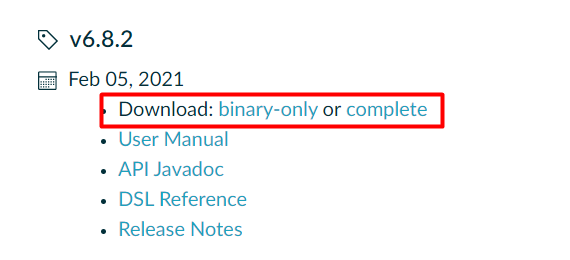

<center>
   <h1>
       Gradle急速入门
    </h1> 
</center>

#  一、基础环境

## 1、下载gradle

https://gradle.org/releases/



> 解压到磁盘


## 2、配置环境变量

GRADLE_HOME、PATH、GRADLE_USER_HOME【可以指向安装目录自己创建的.gradle文件夹】


## 3、配置下载加速

### 1、gradle自己的方式

Gradle还是从maven仓库下载的。

给gradle安装目录下init.d文件夹，放一个init.gradle文件，内容如下：

```groovy
gradle.projectsLoaded {
    rootProject.allprojects {
        buildscript {
            repositories {
                def JCENTER_URL = 'https://maven.aliyun.com/repository/jcenter'
                def GOOGLE_URL = 'https://maven.aliyun.com/repository/google'
                def NEXUS_URL = 'http://maven.aliyun.com/nexus/content/repositories/jcenter'
                all { ArtifactRepository repo ->
                    if (repo instanceof MavenArtifactRepository) {
                        def url = repo.url.toString()
                        if (url.startsWith('https://jcenter.bintray.com/')) {
                            project.logger.lifecycle "Repository ${repo.url} replaced by $JCENTER_URL."
                            println("buildscript ${repo.url} replaced by $JCENTER_URL.")
                            remove repo
                        }
                        else if (url.startsWith('https://dl.google.com/dl/android/maven2/')) {
                            project.logger.lifecycle "Repository ${repo.url} replaced by $GOOGLE_URL."
                            println("buildscript ${repo.url} replaced by $GOOGLE_URL.")
                            remove repo
                        }
                        else if (url.startsWith('https://repo1.maven.org/maven2')) {
                            project.logger.lifecycle "Repository ${repo.url} replaced by $REPOSITORY_URL."
                            println("buildscript ${repo.url} replaced by $REPOSITORY_URL.")
                            remove repo
                        }
                    }
                }
                jcenter {
                    url JCENTER_URL
                }
                google {
                    url GOOGLE_URL
                }
                maven {
                    url NEXUS_URL
                }
            }
        }
        repositories {
            def JCENTER_URL = 'https://maven.aliyun.com/repository/jcenter'
            def GOOGLE_URL = 'https://maven.aliyun.com/repository/google'
            def NEXUS_URL = 'http://maven.aliyun.com/nexus/content/repositories/jcenter'
            all { ArtifactRepository repo ->
                if (repo instanceof MavenArtifactRepository) {
                    def url = repo.url.toString()
                    if (url.startsWith('https://jcenter.bintray.com/')) {
                        project.logger.lifecycle "Repository ${repo.url} replaced by $JCENTER_URL."
                        println("buildscript ${repo.url} replaced by $JCENTER_URL.")
                        remove repo
                    }
                    else if (url.startsWith('https://dl.google.com/dl/android/maven2/')) {
                        project.logger.lifecycle "Repository ${repo.url} replaced by $GOOGLE_URL."
                        println("buildscript ${repo.url} replaced by $GOOGLE_URL.")
                        remove repo
                    }
                    else if (url.startsWith('https://repo1.maven.org/maven2')) {
                        project.logger.lifecycle "Repository ${repo.url} replaced by $REPOSITORY_URL."
                        println("buildscript ${repo.url} replaced by $REPOSITORY_URL.")
                        remove repo
                    }
                }
            }
            jcenter {
                url JCENTER_URL
            }
            google {
                url GOOGLE_URL
            }
            maven {
                url NEXUS_URL
            }
        }
    }
}
```


即可进行加速下载。


### 2、使用原来maven

原来我们安装了maven，有maven_home，就可以使用maven的设置

```groovy
// 在项目 build.gradle文件中设置如下
repositories {  //仓库管理
    mavenLocal()   //优先使用本地maven的仓库设置
    mavenCentral()
}
```


## 4、配置idea整合


> service 目录，是代表gradle自己下载jar包的位置，类似以前maven的本地仓库


# 二、概念对比

## 1、环境变量

GRADLE_HOME = MAVEN_HOME

GRADLE_USER_HOME = maven本地仓库位置

## 2、优势对比


## 3、配置文件

### 1、build.gradle

用来做依赖管理，项目构建所使用的脚本...  配置示例

```groovy
plugins {
    id 'java'
}

group 'com.atguigu'
version '1.0-SNAPSHOT'

sourceCompatibility = 1.8

repositories {  //仓库管理
    mavenLocal()   //优先使用本地maven的仓库设置
    mavenCentral()
}

dependencies {   //依赖管理
    testCompile group: 'junit', name: 'junit', version: '4.12'
    // https://mvnrepository.com/artifact/org.springframework.boot/spring-boot-starter-web
    compile group: 'org.springframework.boot', name: 'spring-boot-starter-web', version: '2.4.2'

}
```


### 2、settings.gradle


# 三、实战


