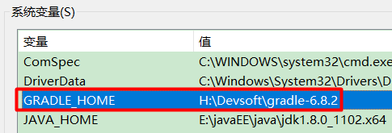
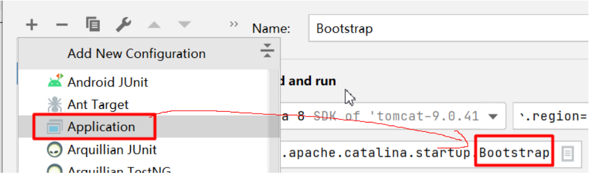

<center>
<h1>
    源码环境搭建合集
    </h1>
</center>

# 一、创建总工程

创建空工程

design-patterns-and-framework-sources


# 二、搭建Spring源码工程

## 1、下载gradle

https://gradle.org/releases/


> 解压到磁盘


## 2、配置环境变量

GRADLE_HOME、PATH、GRADLE_USER_HOME【可以指向安装目录自己创建的.gradle文件夹】




PATH = %GRADLE_USER_HOME%\bin


maven本地仓库  -->  所有的jar包


## 3、配置下载加速

Gradle 还是从 maven 仓库下载的。

给gradle安装目录下init.d文件夹，放一个init.gradle文件，内容如下：

```groovy
gradle.projectsLoaded {
    rootProject.allprojects {
        buildscript {
            repositories {
                def JCENTER_URL = 'https://maven.aliyun.com/repository/jcenter'
                def GOOGLE_URL = 'https://maven.aliyun.com/repository/google'
                def NEXUS_URL = 'http://maven.aliyun.com/nexus/content/repositories/jcenter'
                all { ArtifactRepository repo ->
                    if (repo instanceof MavenArtifactRepository) {
                        def url = repo.url.toString()
                        if (url.startsWith('https://jcenter.bintray.com/')) {
                            project.logger.lifecycle "Repository ${repo.url} replaced by $JCENTER_URL."
                            println("buildscript ${repo.url} replaced by $JCENTER_URL.")
                            remove repo
                        }
                        else if (url.startsWith('https://dl.google.com/dl/android/maven2/')) {
                            project.logger.lifecycle "Repository ${repo.url} replaced by $GOOGLE_URL."
                            println("buildscript ${repo.url} replaced by $GOOGLE_URL.")
                            remove repo
                        }
                        else if (url.startsWith('https://repo1.maven.org/maven2')) {
                            project.logger.lifecycle "Repository ${repo.url} replaced by $REPOSITORY_URL."
                            println("buildscript ${repo.url} replaced by $REPOSITORY_URL.")
                            remove repo
                        }
                    }
                }
                jcenter {
                    url JCENTER_URL
                }
                google {
                    url GOOGLE_URL
                }
                maven {
                    url NEXUS_URL
                }
            }
        }
        repositories {
            def JCENTER_URL = 'https://maven.aliyun.com/repository/jcenter'
            def GOOGLE_URL = 'https://maven.aliyun.com/repository/google'
            def NEXUS_URL = 'http://maven.aliyun.com/nexus/content/repositories/jcenter'
            all { ArtifactRepository repo ->
                if (repo instanceof MavenArtifactRepository) {
                    def url = repo.url.toString()
                    if (url.startsWith('https://jcenter.bintray.com/')) {
                        project.logger.lifecycle "Repository ${repo.url} replaced by $JCENTER_URL."
                        println("buildscript ${repo.url} replaced by $JCENTER_URL.")
                        remove repo
                    }
                    else if (url.startsWith('https://dl.google.com/dl/android/maven2/')) {
                        project.logger.lifecycle "Repository ${repo.url} replaced by $GOOGLE_URL."
                        println("buildscript ${repo.url} replaced by $GOOGLE_URL.")
                        remove repo
                    }
                    else if (url.startsWith('https://repo1.maven.org/maven2')) {
                        project.logger.lifecycle "Repository ${repo.url} replaced by $REPOSITORY_URL."
                        println("buildscript ${repo.url} replaced by $REPOSITORY_URL.")
                        remove repo
                    }
                }
            }
            jcenter {
                url JCENTER_URL
            }
            google {
                url GOOGLE_URL
            }
            maven {
                url NEXUS_URL
            }
        }
    }
}
```


即可进行加速下载。


## 4、配置idea整合


> service 目录，是代表gradle自己下载jar包的位置，类似以前maven的本地仓库

## 5、下载Spring源码

Spring在github上的仓库地址是：https://github.com/spring-projects/spring-framework

Spring在码云上的仓库地址是：https://gitee.com/mirrors/Spring-Framework

或者自己同步源码

## 6、 导入Spring源码

Spring导入到总工程中。使用gradle导入。


使用我们的gradle


# 三、搭建SpringBoot源码工程

GitHub上SpringBoot源码的仓库，https://github.com/spring-projects/spring-boot

Gitee上SpringBoot源码的仓库，https://gitee.com/mirrors/spring-boot/


其他步骤同Spring源码搭建步骤


# 四、搭建Tomcat源码工程

## 1、下载源码


## 2、改造为maven工程

```xml
<!-- pom.xml -->
<?xml version="1.0" encoding="UTF-8"?>
<project xmlns="http://maven.apache.org/POM/4.0.0"
         xmlns:xsi="http://www.w3.org/2001/XMLSchema-instance"
         xsi:schemaLocation="http://maven.apache.org/POM/4.0.0 http://maven.apache.org/xsd/maven-4.0.0.xsd">
    <modelVersion>4.0.0</modelVersion>
    <groupId>org.apache.tomcat</groupId>
    <artifactId>tomcat9</artifactId>
    <name>tomcat-9.0.41</name>
    <version>9.0.41</version>
    <build>
        <finalName>tomcat-9.0.41</finalName>
        <sourceDirectory>java</sourceDirectory>
        <!--<testSourceDirectory>test</testSourceDirectory>  test 下的有些文件报错，因此将test文件夹去掉了-->
        <resources>
            <resource>
                <directory>java</directory>
            </resource>
        </resources>
        <testResources>
            <testResource>
                <directory>test</directory>
            </testResource>
        </testResources>
        <plugins>
            <plugin>
                <groupId>org.apache.maven.plugins</groupId>
                <artifactId>maven-compiler-plugin</artifactId>
                <version>3.6.0</version>
                <configuration>
                    <encoding>UTF-8</encoding>
                    <source>1.8</source>
                    <target>1.8</target>
                </configuration>
            </plugin>
            <plugin>
                <groupId>org.apache.maven.plugins</groupId>
                <artifactId>maven-jar-plugin</artifactId>
                <version>3.0.2</version>
            </plugin>
        </plugins>
    </build>
     <dependencies>
        <dependency>
            <groupId>org.apache.ant</groupId>
            <artifactId>ant</artifactId>
            <version>1.9.5</version>
        </dependency>
         <!-- https://mvnrepository.com/artifact/biz.aQute.bnd/annotation -->
         <!-- https://mvnrepository.com/artifact/biz.aQute.bnd/biz.aQute.bndlib -->
         <dependency>
             <groupId>biz.aQute.bnd</groupId>
             <artifactId>biz.aQute.bndlib</artifactId>
             <version>5.2.0</version>
             <scope>provided</scope>
         </dependency>

         <!-- https://mvnrepository.com/artifact/org.apache.jasper/org.apache.jasper -->
         <!-- https://mvnrepository.com/artifact/org.apache.tomcat/tomcat-jasper -->
         <dependency>
             <groupId>org.apache.tomcat</groupId>
             <artifactId>tomcat-jasper</artifactId>
             <version>9.0.41</version>
         </dependency>
         <dependency>
            <groupId>org.apache.ant</groupId>
            <artifactId>ant-apache-log4j</artifactId>
            <version>1.9.5</version>
        </dependency>
        <dependency>
            <groupId>org.apache.ant</groupId>
            <artifactId>ant-commons-logging</artifactId>
            <version>1.9.5</version>
        </dependency>
        <dependency>
            <groupId>javax.xml.rpc</groupId>
            <artifactId>javax.xml.rpc-api</artifactId>
            <version>1.1</version>
        </dependency>
        <dependency>
            <groupId>wsdl4j</groupId>
            <artifactId>wsdl4j</artifactId>
            <version>1.6.2</version>
        </dependency>
        <dependency>
            <groupId>org.eclipse.jdt.core.compiler</groupId>
            <artifactId>ecj</artifactId>
            <version>4.6.1</version>
        </dependency>
    </dependencies>
</project>
```


## 3、导入idea


## 4、创建启动类




## 5、添加vm-options


```properties
-Duser.language=en
-Duser.region=US
-Dfile.encoding=UTF-8
-Dsun.jnu.encoding=UTF-8
```


# 五、搭建MyBatis源码

